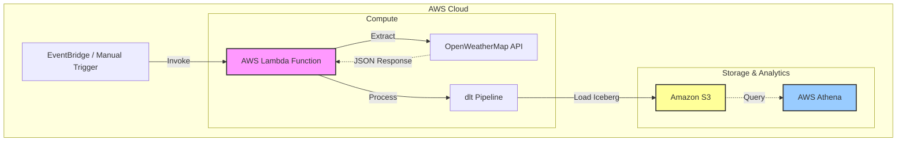

# 🌦️ Serverless Weather ETL Pipeline


A robust, serverless ETL (Extract, Transform, Load) pipeline designed to ingest real-time weather data for major Australian cities. Built with **AWS CDK**, **AWS Lambda**, and **dlt** (Data Load Tool), this project demonstrates a modern, scalable approach to data warehousing using **AWS Athena** and **Apache Iceberg**.

## 🏗️ Architecture

The pipeline leverages a serverless architecture to ensure scalability and cost-efficiency.



## 🚀 Key Features

- **Serverless Compute**: Runs entirely on AWS Lambda, utilizing AWS Lambda Layers for efficient dependency management.
- **Infrastructure as Code**: Fully defined and deployed using AWS CDK (Cloud Development Kit) in Python.
- **Modern Data Loading**: Utilizes `dlt` for robust data extraction, normalization, and schema evolution.
- **Open Table Format**: Stores data in **Apache Iceberg** format via AWS Athena for high-performance analytics.

## 💻 Tech Stack

- **Infrastructure**: AWS CDK (Python)
- **Compute**: AWS Lambda (Python Runtime)
- **ETL Framework**: dlt (Data Load Tool)
- **Storage**: Amazon S3 (Iceberg format)
- **Query Engine**: AWS Athena
- **Package Manager**: uv (Fast Python package installer)
- **Language**: Python 3.12+

## 📂 Project Structure

```bash
.
├── lambda/                 # Lambda function code
│   └── extract_load_lambda.py  # Main ETL script
├── layers/                 # Lambda Layers
│   └── python/             # Python dependencies
├── stacks/                 # AWS CDK Stacks
│   └── dlt_stacks.py           # Infrastructure definition
├── app.py                  # CDK App entry point
├── cdk.json                # CDK configuration
├── .gitignore              # Git ignore file
├── .python-version         # Python version file
├── pyproject.toml          # Project configuration
├── requirements.txt        # Project dependencies
├── uv.lock                 # Dependency lock file
└── README.md               # Project documentation
```

## 🛠️ Prerequisites

Before deploying, ensure you have the following:

- **AWS Account** with CLI configured.
- **Node.js** (for AWS CDK).
- **Python 3.12+**.
- **OpenWeatherMap API Key**.

## ⚡ Quick Start

### 1. Clone & Install

```bash
# Install AWS CDK globally (if not already installed)
npm install -g aws-cdk

# Install uv (An extremely fast Python package installer and resolver, written in Rust)
pip install uv

# Clone the repository
git clone https://github.com/ayushacharya007/dlt-etl-lambda
cd dlt-etl-lambda

# Create virtual environment and install dependencies using uv (much faster than pip)
uv venv
source .venv/bin/activate
uv sync
```

### 2. Configure Environment

Create a `.env` file in the root directory (or set environment variables in your deployment environment):

```env
WEATHER_API_KEY=your_api_key_here
```

### 3. Deploy with CDK

```bash
# Install CDK dependencies
npm install

# Synthesize the CloudFormation template
cdk synth

# Deploy the stack
cdk deploy
```

## 📊 Data Schema

The pipeline captures the following data points for each city:

| Field                 | Type      | Description                        |
| --------------------- | --------- | ---------------------------------- |
| `city`                | String    | Name of the city (Primary Key)     |
| `date`                | Timestamp | Collection timestamp (Primary Key) |
| `country`             | String    | Country code (e.g., AU)            |
| `temperature`         | Float     | Current temperature (°C)           |
| `feels_like`          | Float     | Feels like temperature (°C)        |
| `minimum_temperature` | Float     | Minimum temperature (°C)           |
| `maximum_temperature` | Float     | Maximum temperature (°C)           |
| `humidity`            | Integer   | Humidity percentage                |
| `wind_speed`          | Float     | Wind speed (m/s)                   |
| `sunrise`             | String    | Sunrise time (HH:MM:SS)            |
| `sunset`              | String    | Sunset time (HH:MM:SS)             |

---

_@Ayush Acharya_
